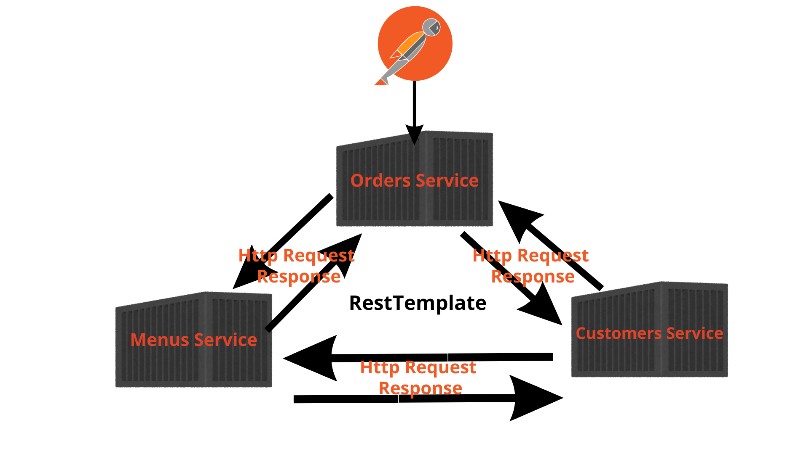

# Microservices-Based Ordering System

This project is a microservices-based architecture for an ordering system. It consists of three main services that communicate with each other using **HTTP requests** via **RestTemplate**.

## Architecture Overview
Below is a high-level visualization of how the microservices interact with each other:

Each service has a specific responsibility and works independently, ensuring scalability and flexibility.

---

## **Microservices Overview**
### **1. Orders Service**
- Handles customer orders.
- Communicates with **Menus Service** to fetch available menu items.
- Communicates with **Customers Service** to validate customer details.

### **2. Menus Service**
- Manages menu items and their details.
- Provides available menu items to the **Orders Service**.

### **3. Customers Service**
- Manages customer details and authentication.
- Provides customer verification for order processing.

---

## **How to Run the Services**
Each microservice is a Spring Boot application. Follow these steps to run them:

1. **Open in IntelliJ IDEA** – Import the project and open all services.
2. **Run the Main Class** – Each service has a `Main` class located in the `src/main/java` directory:
    - Orders Service → `OrdersServiceApplication.java`
    - Menus Service → `MenusServiceApplication.java`
    - Customers Service → `CustomersServiceApplication.java`
3. Each service will start on its respective port and begin communicating via HTTP.

---

## **API Communication**
Each service communicates using **RestTemplate**, sending HTTP requests and receiving responses.

- Orders Service → Calls Menus & Customers Services.
- Menus Service → Responds to Orders Service.
- Customers Service → Responds to Orders Service.

For a better experience, make sure all services are up and running before sending requests.

---

## **License**
This project is open-source and can be modified as needed.
